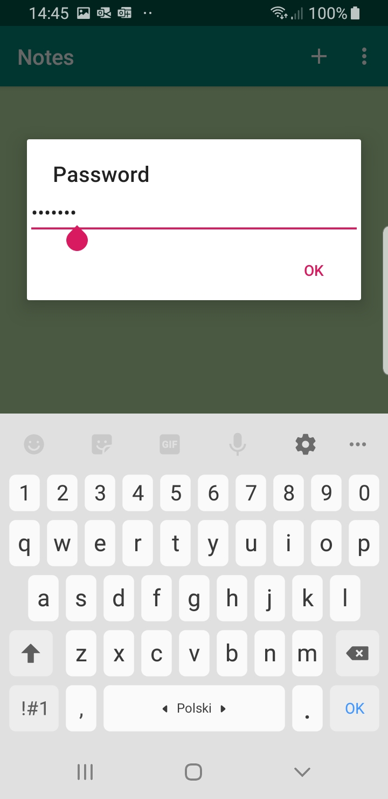
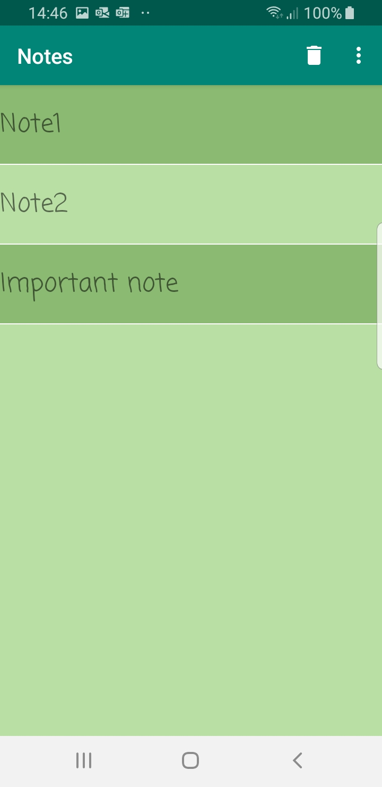
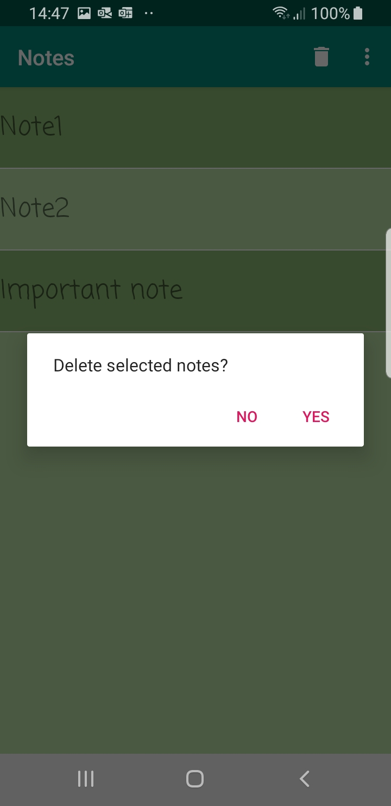
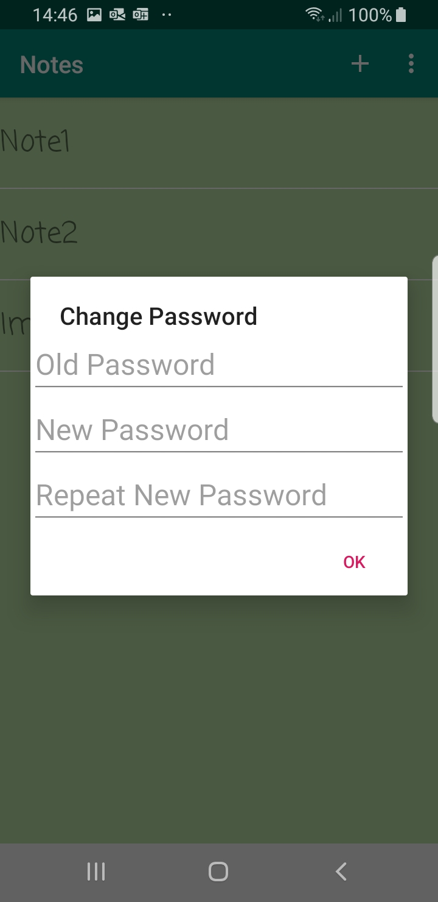

# Notes

Android app where you can make notes and protect this app with password.

## Requirements

Min SDK: 24 (Android 7.0)

Target SDK: 29 (Android 10.0)

## Features

- Set password
- Change password
- Add notes
- Edit notes
- Delete notes

---

## Presentation

- Check password

    

- Note content

    

- Select notes

    

- Delete notes

    
    

- Change password

    
