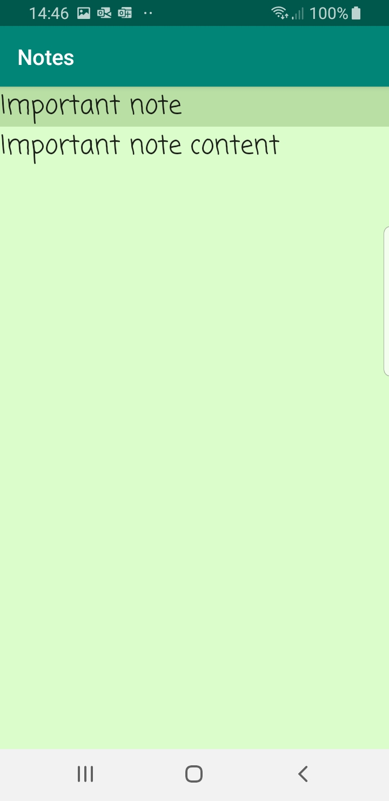

# Notes

Android app where you can make notes and protect this app with password.

It stores your password and notes **securely** by encrypting them using **AES in CTR mode**.

## Requirements

Min SDK: 24 (Android 7.0)

Target SDK: 29 (Android 10.0)

## Features

- **Security**
- Set password
- Change password
- Add notes
- Edit notes
- Delete notes

## Security details

Your password and notes are protected against any violation using AES (Advanced Encryption Standard) in CTR mode of operation.

- **password security**
    - Every time you set new password new salt and nonce is generated to encrypt it.
    - Nonce is also encrypted using AES in ECB mode (ECB is not safe unless you use it to encrypt only one block of data. Nonce fits in one block of data)
    - Salt is not encrypted

- **notes security**
    - Every time you create or modify your note new salt and nonce is generated unique for each note.
    - Note title and content is encrypted using AES in CTR mode
    - Nonce is encrypted using AES in ECB mode
    - Salt is not encrypted

(***nonce*** - number used once, used to create IV (initialization vector) to encrypt in CTR mode)

---

## Presentation

- Check password

    

- Note content

    

- Select notes

    

- Delete notes

    

- Change password

    
